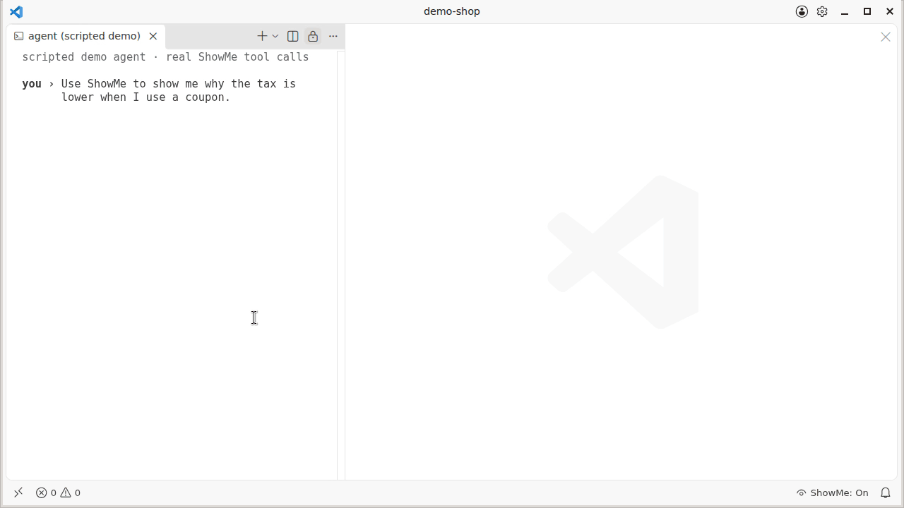
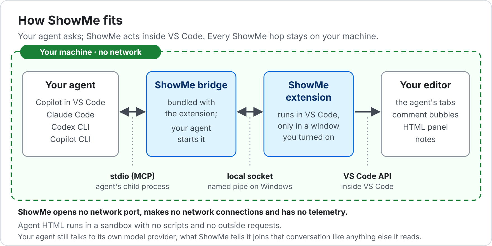
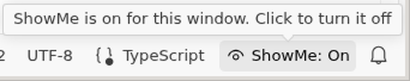
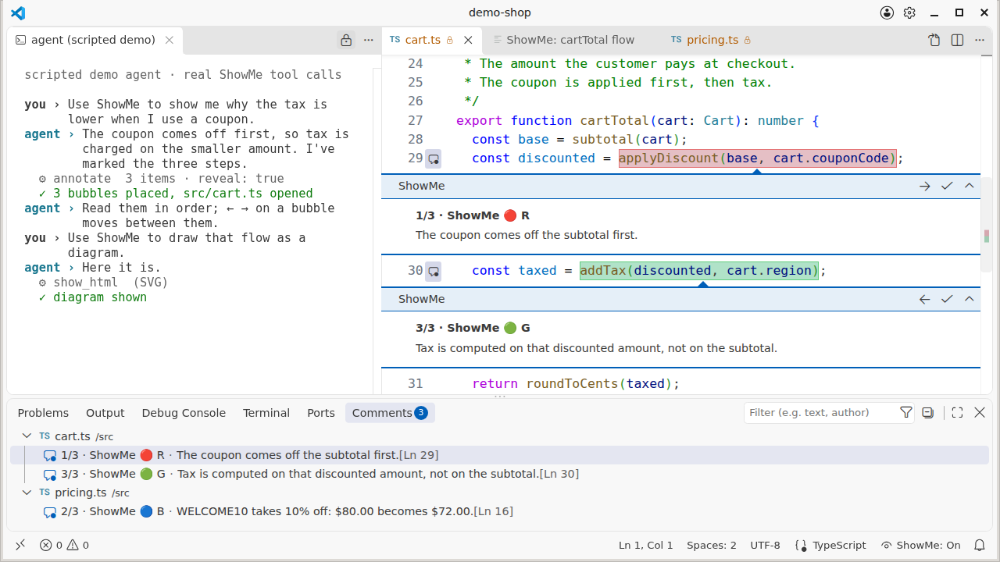
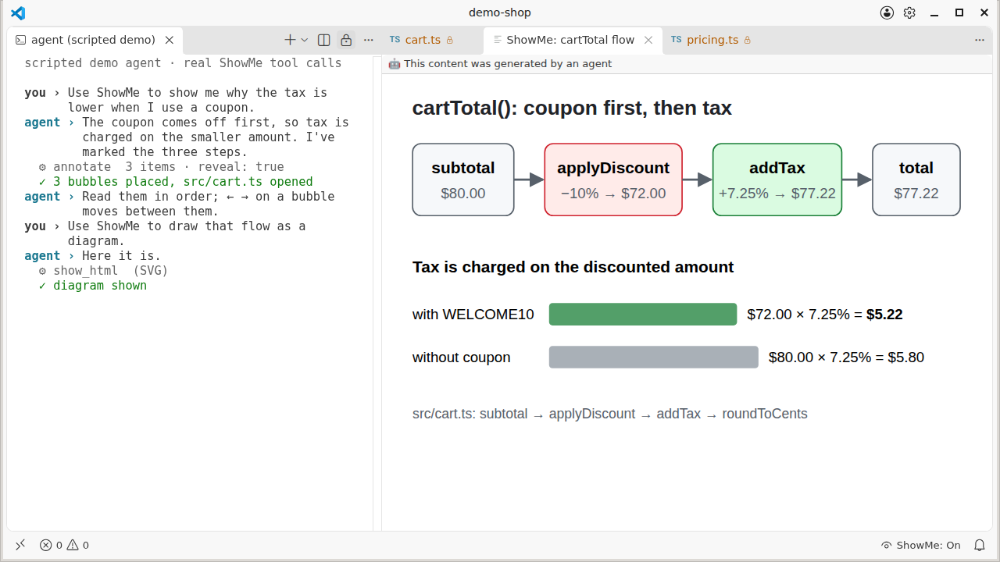

# vscode-showme

> 日本語: [README.ja.md](README.ja.md)

**Give AI agents hands in VS Code.**

Claude Code, Copilot CLI and Codex can change your code, but they cannot touch your screen.
vscode-showme fills exactly that gap: while an agent walks you through an unfamiliar repository,
it can open the file, point at lines with numbered comments, put two places side by side,
draw a diagram and pin a note — the way a colleague sitting next to you would.

**No network.** ShowMe opens no network port, makes no network connections and has no telemetry.
The bridge your agent starts and the extension in VS Code talk over a local socket (a named pipe on
Windows); ShowMe itself sends nothing off your machine. Your agent still talks to its model provider
as usual, and what ShowMe tells the agent (where things are, what you have selected) becomes part of
that conversation like anything else the agent reads. See [How it fits](#how-it-fits).

## What it does not do

- No code editing, no shell, no diagnostics/LSP — your agent already has those.
- No pre-generated tours, no LLM calls of its own. The teaching is the agent's job.

## How it fits

Your agent starts the ShowMe bridge, which is bundled with the extension, as its own child process
and talks MCP to it over stdio (Copilot in VS Code has VS Code start it). The bridge connects to the
ShowMe extension over a Unix socket, or a named pipe on Windows, and both sides prove they hold a
connection token kept in a folder only your account can read (on Windows, also SYSTEM and
Administrators). There is no HTTP server and no TCP port. A named
pipe on Windows can in principle be opened over the network through SMB (`\\<host>\pipe\…`), but
only with your account's credentials, and the connection still needs the token. HTML the agent
shows runs in a sandbox with no scripts and no outside requests (`connect-src 'none'`, images only as
`data:`). More in [Safety, in one table](#safety-in-one-table).

## Requirements

- **VS Code 1.101 or later.** This is the only thing ShowMe itself needs.
- **An AI agent you already use** — any one of Copilot in VS Code (agent mode), Claude Code,
  Codex CLI or Copilot CLI. ShowMe gives that agent hands in VS Code; it does not include an agent.

Node.js is **not** required: ShowMe starts its bridge with VS Code's own runtime. If you prefer,
Claude Code, Codex CLI and Copilot CLI can start it with Node.js 20 or later instead (see
[Agent setup in detail](#agent-setup-in-detail)).

## Getting started

| Your agent | What to do |
|---|---|
| Copilot in VS Code (agent mode) | Install the extension. That is all: it registers itself with VS Code. |
| Claude Code, Codex CLI, Copilot CLI | Install the extension, run **ShowMe: Copy agent setup command**, choose your agent, paste the copied line or block where the message says, and restart the agent. |

Then, with any agent: click **`ShowMe: Off`** in the status bar so that it says **`ShowMe: On`**,
and ask your agent "Use ShowMe to …".

When you install the extension, VS Code's Get Started page shows a **Get started with ShowMe**
walkthrough with these three steps. Open it again any time with **ShowMe: Get started**.

### Quick start

1. **Install the extension** from the VS Code Marketplace or Open VSX (`zvxbase.vscode-showme`), or
   download the VSIX from [Releases](https://github.com/zvxbase/vscode-showme/releases) and run
   `code --install-extension vscode-showme-<version>.vsix`. The bridge your agent talks to is
   bundled with the extension — there is nothing to install from npm.
2. **Register ShowMe with your agent** (Claude Code, Codex CLI and Copilot CLI; Copilot in VS Code
   skips this step). The quickest way is **ShowMe: Copy agent setup command** in the Command Palette:
   choose your agent, and ShowMe copies its line or block to the clipboard and tells you where to
   paste it. For everything else, run **ShowMe: Show agent configuration**. It opens a
   read-only document with ready-to-paste snippets, filled in with the real install path:
   - **Claude Code** — run the `claude mcp add` line in a terminal, and add the listed rules to
     `permissions.allow` in `.claude/settings.json` (without them, Claude Code asks before every call).
   - **Codex CLI** — add the `[mcp_servers.showme]` section to `~/.codex/config.toml`.
   - **Copilot CLI** — add the `"showme"` entry to `~/.copilot/mcp-config.json`, and start it with
     `--allow-tool 'showme'`.

   Then restart your agent (or start a new session) so that it loads ShowMe.
3. **Turn it on in the window you want the agent to use.** Nothing is driven until you allow it.
   Click **`ShowMe: Off`** in the status bar of that window → it becomes **`ShowMe: On`**, and
   **`ShowMe: Connected`** once the agent connects. Click again to turn it off. You can open the same
   folder in two windows and turn ShowMe on in only one of them; the agent uses that one.

   
4. **Ask your agent.** Say "Use ShowMe to …" so that it reaches for ShowMe — see below.

### What to ask

Start with "Use ShowMe to …". The agent shows and explains, then stops; you read at your own pace
and ask the next question.

- "Use ShowMe to walk me through how a request is handled in this repo." — The agent opens each
  file in its own tab and leaves numbered comment bubbles in the order to read them; **‹ ›** on a
  bubble takes you to the previous or next one.
- "Use ShowMe to show me where `parseConfig` is defined and where it is used, side by side." — The
  definition and a call site open next to each other.
- "Use ShowMe to annotate the important lines of `src/server.ts`." — Bubbles appear under those
  lines, numbered in reading order (`1/7 ·`, `2/7 ·`, …).
- "Use ShowMe to draw how these modules depend on each other." — A diagram opens in a panel next to
  your code.

### Agent setup in detail

**Two forms.** For Claude Code, Codex CLI and Copilot CLI, the configuration that ShowMe shows you
gives every agent two complete forms of the same entry. Use one of them:

- **VS Code's runtime** needs no Node.js. Choose it when Node.js is not installed. Its path belongs
  to your VS Code installation, so in some setups (remote, AppImage, Nix) you set it up again after
  VS Code updates or restarts. The Flatpak build of VS Code does not offer this form, because agents
  outside the sandbox cannot start its runtime.
- **`node`** needs Node.js 20 or later on your `PATH`. Check with `which node` (on Windows,
  `where.exe node`) in the terminal where you start your agent; after you install Node.js, quit VS
  Code and that terminal completely and start them again. Choose it when Node.js is installed: it
  does not depend on where VS Code is, so it keeps working when VS Code updates, and on Windows
  the VS Code updater does not stop it.

**What each agent gets.** Copy the snippets for your agent from
**ShowMe: Show agent configuration**. ShowMe never edits other tools' configuration files itself.

- **Claude Code** — one `claude mcp add` line for each form (`claude mcp add -e ELECTRON_RUN_AS_NODE=1 --transport stdio showme -- …` and `claude mcp add --transport stdio showme -- node …`), plus a list of permission rules to
  add to `permissions.allow` in `.claude/settings.json`. Without those rules, Claude Code asks for
  confirmation on every call, even for display-only tools.
- **Codex CLI** — a `[mcp_servers.showme]` section in each form for `~/.codex/config.toml`. No permission
  setup is needed.
- **Copilot CLI** — a `"showme"` entry in each form for `~/.copilot/mcp-config.json`; start it with
  `--allow-tool 'showme'`.
- **Copilot agent mode inside VS Code** — nothing to do. The extension registers itself as an
  MCP server (this does not work in Restricted Mode).

**Where VS Code is installed.** The document lists the runtime form first. If VS
Code moves to another folder, open **ShowMe: Show agent configuration** again for the current path.
When VS Code is connected to a remote (WSL, SSH or a dev container), the runtime path belongs to the
VS Code Server and changes every time VS Code updates, so the document lists the `node` form first
there; with the runtime form, set it up again after an update. The same goes for
VS Code run as an AppImage and, on macOS, for VS Code started where it was downloaded (App
Translocation): there the path changes every time VS Code restarts. For VS Code from the Nix store,
the path changes on every upgrade. With the Flatpak build of VS Code,
the document shows only the `node` form, because an agent outside the sandbox cannot start VS Code's
runtime. With the Snap build, the snippets point at `/snap/code/current/`, which follows updates.

The snippets start the newest ShowMe installed, so you do not need to paste them again after the
extension updates. On Windows, the `claude mcp add` lines name the installed version's folder instead,
so that it works in both PowerShell and Command Prompt; run it again after the extension updates.

`arrange_editors` is left out of the Claude Code allow list on purpose: it is the only tool that
can close tabs. Add `"mcp__showme__arrange_editors"` yourself if you want it.

**Scopes: this repository, all repositories, or your team.** The same document covers each scope.
Claude Code's default (`--scope local`) is already this repository and only you; `--scope user`
covers all your repositories, and `--scope project` shares it with your team through `.mcp.json`.
Codex CLI reads `.codex/config.toml` in the repository for trusted projects. Copilot CLI reads
`.mcp.json` or `.github/mcp.json` (with `"tools": ["*"]`) once you trust the folder; one
`.mcp.json` entry can serve both Claude Code and Copilot CLI. The snippets contain this machine's
install path, so a committed file does not work as is on other people's machines — when ShowMe is
installed under your home folder, the document also shows an entry that finds it under each
person's home folder (that entry starts ShowMe with `node`, so it needs Node.js 20 or later). Check the MCP configuration in someone else's repository before you approve
it.

The document ends with a prompt you can give your agent so that it does the setup for you. You are
responsible for what the agent changes: read the prompt first.

**Same machine, same environment.** The agent and VS Code must run on the same machine and in the
same environment: in a devcontainer, both inside the container; with Remote-SSH, both on the remote
side; with VS Code connected to WSL, the agent inside WSL. An agent running on Windows cannot reach a
VS Code window connected to WSL, and the other way around.

## What you will see

- **The agent's tabs** — files the agent shows open in its own tabs: a read-only mirror of the file
  that also shows your unsaved edits. The tab name is colored and carries an **SM** badge (read-only
  tabs show a lock icon instead), so you can tell them apart from your own; Go to Definition and
  Find References work there too. They stay the agent's even if you move them, so it can tidy them
  up. A tab you open yourself on the same file stays yours.
- **Open the real file** — the **`ShowMe: Open the real file`** button in the tab title bar opens
  the same file at the same line in the column you're in (next to the agent's tab). That tab is yours, not the agent's: `arrange_editors`' `close-own` does not close it.
- **Annotations** — speech bubbles under lines in the agent's tabs, numbered in the agent's reading order (`1/7 ·`).
  This is how the agent points at code: every painted spot comes with a comment. The paint is in the
  bubble's color (grey when the agent gives none), and covers only the matched text when the agent
  located it by searching for text (the whole line if that text appears on it more than once). Opening a file with `show_code` paints nothing.
  Use the `‹ ›` buttons in the bubble (**Previous annotation** / **Next annotation**) to follow
  them. They open the agent's tab, possibly in your column, and the agent may tidy it up once
  you look away. **Resolve** marks one as read; **Unresolve** takes that back.
- **HTML panels** — tables and diagrams. Scripts never run in them.
- **Notes** — an untitled editor. Nothing is saved unless you save it.
- **Clean up** — **ShowMe: Clear annotations** (removes the bubbles and their paint together).

## Commands

These are in the Command Palette (Ctrl+Shift+P, or Cmd+Shift+P on macOS).

<!-- BEGIN GENERATED: commands -->
| Command | What it does |
|---|---|
| **ShowMe: Turn on / off for this window** | Lend this window to the agent, or take it back. The same as clicking ShowMe in the status bar. |
| **ShowMe: Stop / Resume the extension** | Stop ShowMe in every window, or resume it. It stays stopped until you resume it (saved as showme.enabled in your user settings). |
| **ShowMe: Show agent configuration** | Open ready-to-paste configuration for Claude Code, Codex CLI and Copilot CLI, filled in with the real install path. |
| **ShowMe: Copy agent setup command** | Copy the setup command for one agent (Claude Code, Codex CLI or Copilot CLI) to the clipboard and say where to paste it. ShowMe does not edit the agent's files. |
| **ShowMe: Get started** | Open the Get Started walkthrough: turn ShowMe on, connect your agent, and what to ask. |
| **ShowMe: Show the operations log** | Open the log of every tool call (selected text is not recorded). |
| **ShowMe: Show teardown steps and how to remove the configuration** | Open the steps to remove ShowMe from your agent and uninstall it. |
| **ShowMe: Clear annotations** | Remove all of the agent's annotations. |
| **ShowMe: Open the real file** | Open the file of the agent's tab at the same line, as your own tab. Listed only while one of the agent's tabs is active. |
<!-- END GENERATED: commands -->

The buttons in the annotation bubbles (`‹ ›` for **Previous annotation** / **Next annotation**, and
**Resolve** / **Unresolve**) are not in the Command Palette: they act on the bubble you click.

## Tools

| Tool | What it does |
|---|---|
| `list_workspaces` | Tells the agent which VS Code window it is connected to |
| `get_editor_state` | Where you are looking: active file, cursor, selection, visible lines, open tabs |
| `show_code` | Opens a file and scrolls to a location, without highlighting it. `realFile: true` opens the real file instead, for you to edit |
| `annotate` | Points at code: leaves numbered speech bubbles under lines and paints the spot (grey without a color; only the matched text when located by text, or the whole line when that text appears on it more than once). `reveal: true` also opens the file and scrolls to the first bubble, the same way `show_code` does. `realFile: true` puts them on the real file |
| `show_html` | Shows a table or diagram in a panel (no scripts) |
| `show_note` | Opens an untitled note |
| `find_definition` | Where a symbol is defined (like Go to Definition) |
| `find_references` | Where a symbol is used |
| `show_view` | Reveals a file in the explorer, switches the sidebar, toggles the panel, Zen mode |
| `arrange_editors` | Arranges and tidies editor columns (closes only its own panels by default) |

No tool returns file contents. The agent reads files with its own tools.

## Settings

All of these are user settings. A repository's `.vscode/settings.json` cannot change the safety
settings.

<!-- BEGIN GENERATED: settings -->
| Setting | Default | Meaning |
|---|---|---|
| `showme.enabled` | `true` | Accept connections from agents. Turning it off stops ShowMe in every window. Use the command "ShowMe: Stop / Resume the extension" to switch it. |
| `showme.stage.enabled` | `true` | Let the agent open files and tabs, scroll, and split the editor area (show\_code opening files, show\_note). When off, show\_code only resolves the location without opening it, annotate does not open files even with reveal, and show\_note is refused. Annotations and the reading tools always work. |
| `showme.stage.editorGroup` | `"shared"` | Which editor column the agent opens files, notes and panels in. Changing this does not change which of your tabs the agent may close or move. `"shared"`: Default. Reuse the columns to the right of yours first. If there are none, use your column instead of adding one; add a column only when a split layout still needs more. `"dedicated"`: Keep your column for you: open in the columns to the right, adding one when needed. Your column is still used when it has none of your tabs (it is empty or holds only the agent's tabs). `"active"`: Always open in your column, ignoring the agent's layout and slots. |
| `showme.stage.agentTabs` | `true` | Open the agent's editors as its own tabs (a mirror of the file, read-only unless showme.stage.editable is on). The agent's tabs are marked: the tab name is shown in the color showme.agentTabForeground (themes can change it), and an "SM" badge appears where VS Code shows badges (read-only tabs show their lock icon instead of the badge). They stay the agent's even if you move them or open the same file yourself, so the agent can tidy them up. When off, the agent opens ordinary file tabs as before. Changing this affects only tabs opened afterwards; tabs already open stay as they are. |
| `showme.stage.editable` | `false` | Let you edit and save in the agent's tabs. Saving writes the real file. Edits in the agent's tab are not visible in your own tab of the same file until you save. A file you cannot write (read-only on disk, or a hard link) opens read-only. Has no effect unless showme.stage.agentTabs is on. Changing this affects only tabs opened afterwards; tabs already open stay as they are. |
| `showme.stage.definitionTarget` | `"file"` | Where Go to Definition (Ctrl+click / F12) in the agent's tab takes you for a name defined in another file. Jumps within the same file stay in the agent's tab either way. Find All References follows the same rule. `"file"`: Open the real file (your own tab), so you can start working there. `"agentTab"`: Open it in the agent's tab, so you can keep reading alongside the agent. |
| `showme.stage.avoidToolColumns` | `false` | Keep the agent from opening files, notes and panels in columns that show a terminal, another extension's panel (including agents such as Claude Code and Copilot), or another non-file tab such as Settings. It uses another column instead, and declines when no column can be used; arrange\_editors also declines presets and moves that would use such a column. Off by default. showme.stage.editorGroup: "active" only affects where the agent opens things — the arrange\_editors declines still apply. |
| `showme.html.enabled` | `true` | Let the agent show HTML panels (show\_html). When off, show\_html is refused. |
| `showme.html.maxPanels` | `2` | How many HTML panels the agent may show at once. Default 2. 0 means no limit, but every panel keeps using memory until you close it. The agent is told the limit. |
| `showme.layout.enabled` | `true` | Let the agent rearrange, move and close editors and switch views (arrange\_editors, show\_view). When off, both are refused. |
| `showme.layout.closeHumanTabs` | `false` | Whether arrange\_editors may close or move the tabs you opened, not only the panels the agent put up itself. By default it does not close them. |
| `showme.layout.closeDirtyTabs` | `false` | Whether arrange\_editors may also close unsaved tabs. By default unsaved tabs stay, even with showme.layout.closeHumanTabs enabled. |
| `showme.layout.protectViewingTab` | `false` | When on, the agent never closes or moves the tab you are currently viewing. Off by default: the agent may tidy up tabs it opened itself even while you view them. Whether your own tabs and unsaved tabs may be closed is still governed by showme.layout.closeHumanTabs and showme.layout.closeDirtyTabs. |
| `showme.redactedPathPatterns` | `[]` | More path patterns to hide from the agent. You can only add: the built-in list (.env / .env.\* / \*.pem / \*.key / \*.p12 / \*.pfx / id\_rsa\* / id\_ed25519\* / credentials\* / \*.keystore / .npmrc / .netrc) cannot be removed. The agent is refused when it asks for a matching file, and selected text in such a file is never returned. |
| `showme.blockLinksToRedactedFiles` | `true` | Treat hard links to redacted files (such as .env) as redacted, even when the link has a name that is not redacted. Ordinary hard links (such as those in pnpm's node\_modules) are unaffected, except in very large workspaces (over 50,000 entries outside the folders that are never scanned: .git, node\_modules, .venv, venv, target, .tox, \_\_pycache\_\_ and .cache), where they are refused and the operations log says so. When off, hard links are judged by their name only. |
| `showme.allowOutsideWorkspace` | `false` | Let the agent open files outside the workspace, by absolute path. Off by default; turn it on at your own risk. Two risks: (1) it lets the agent get around the folder restrictions you set for it — file contents are never returned to the agent, but by searching the same file again and again it can still work out what is in it; (2) a malicious instruction hidden in a repository you are reading could make the agent put secret files from your home folder on your screen, where screen sharing or recording would leak them. Even when on, files matching the redacted path patterns and credential locations such as ~/.ssh, ~/.aws, ~/.config/gh, ~/.claude, browser profiles and shell history (under any user's home) stay blocked, and hard-linked files outside the workspace are refused (unless showme.blockLinksToRedactedFiles is off) — but not everything can be protected. |
| `showme.maxSelectionChars` | `4000` | Maximum number of characters of selected text that get\_editor\_state returns. |
| `showme.injectTerminalEnv` | `true` | Put SHOWME\_SOCK (the path of ShowMe's socket) into integrated terminals. Turn it off if you do not want other processes of yours, such as build scripts, to receive that path; agents then find ShowMe through the file it registers instead. |
| `showme.listAllWorkspaces` | `false` | Let list\_workspaces also return VS Code windows other than the one the agent is connected to. Off by default. When on, the agent can see the folder paths of the other windows. |
<!-- END GENERATED: settings -->

With the default `editorGroup: "shared"` the agent may open a tab in your column. If you are typing
there at that moment, a few keystrokes can land in the agent's tab. Agent tabs are read-only by
default, so the keystrokes are simply lost; with `showme.stage.editable: true` they edit the
agent's tab, visibly, and reach the real file only when you save. Set `showme.stage.editorGroup: "dedicated"`
(and `showme.layout.protectViewingTab: true`) to keep the agent out of your column as before.

To stop everything at once: **ShowMe: Stop / Resume the extension**. Every tool call is recorded
in **ShowMe: Show the operations log** (selected text is not recorded).

### Opening files outside the workspace

By default the agent can only point at files inside the workspace. If you turn on
`showme.allowOutsideWorkspace` (user settings only; a repository cannot turn it on), the agent can
also show, annotate and search files outside it, by **absolute path** (`~` is not expanded).
It is off by default because it has two risks you accept by turning it on:

- **It lets the agent get around the folder restrictions you gave it.** ShowMe never returns file
  contents, but an agent that searches the same file again and again can still work out what is in it.
- **A malicious instruction in a repository you are reading can put your secret files on screen.**
  If you are sharing your screen or recording, they leak.

Even when it is on, ShowMe still refuses the redacted path patterns (`.env`, keys and your own
patterns), credential locations in any user's home (such as `~/.ssh`, `~/.aws`, `~/.config/gh`,
`~/.claude`, browser profiles and shell history), system folders such as `/proc`, and hard-linked
files outside the workspace. This list cannot protect everything. While the setting is on, the
status bar shows `ShowMe: On` / `ShowMe: Connected` with a warning icon on a warning background.

HTML files for `show_html` and **Reveal in Explorer** stay workspace-only. The agent's tab of an
outside file is not refreshed when the file changes on disk; ask the agent to show it again.
On Windows, a path with a part like `NAME~1` in it (the 8.3 short-name form, such as `C:\PROGRA~1\…`) is
refused even when the file itself is allowed, because a short name is a second spelling of the same file;
use the long name.

## Troubleshooting

Look at the status bar first — ShowMe shows what it is doing there.

| Status bar | Meaning |
|---|---|
| `ShowMe: Off` | This window is not lent to the agent. Click to turn it on |
| `ShowMe: On` | Turned on, but no agent is connected yet |
| `ShowMe: Connected` | Working |
| `ShowMe: On` / `ShowMe: Connected` with a warning icon and a warning background | `showme.allowOutsideWorkspace` is on: the agent can also open files outside the workspace. Turn it off when you do not need it |
| `ShowMe: Stopped` | The extension is stopped. Run **ShowMe: Stop / Resume the extension** |
| `ShowMe: Failed to start` | The tooltip says why. If it names a directory, check its owner and permissions with `ls -ld` (on Windows, `icacls`) |
| `ShowMe: second connection refused` | Only one agent can connect at a time. Stop the other one. If you are not running a second agent, some other process of yours connected first — find out what it is |
| `ShowMe: not found …` / `ShowMe: multiple matches …` | The agent looked for a location and did not find exactly one. The agent needs to be more specific |
| `ShowMe: rate limited …` | The agent repeated the same request too quickly |

**The agent says it cannot find a VS Code window.** Check that ShowMe is `On` in a window, that
the agent runs in the same environment as VS Code (see [Agent setup in detail](#agent-setup-in-detail)), and that both see the same
`$TMPDIR` (on Windows, the same `TEMP`).

**VS Code's Copilot shows `spawn node ENOENT` for ShowMe.** ShowMe 0.1.5 and earlier started the
bridge with `node` from the `PATH` that VS Code had when it started. Update ShowMe to 0.1.6 or later,
which uses VS Code's own runtime. If you stay on 0.1.5, install Node.js and then quit VS Code
completely and start it again (opening a new window is not enough).

**Windows: the agent loses ShowMe after VS Code updates.** The VS Code updater stops every program
running from VS Code's folder, including a ShowMe that your agent started with VS Code's runtime.
Reconnect ShowMe in your agent (in Claude Code, `/mcp`). Starting ShowMe with `node` (Node.js 20 or
later) avoids this.

**Configure Tools shows only "Update Tools" under ShowMe.** In a workspace where ShowMe has not run
yet, VS Code does not know its tools until it starts the server, and it starts it when you send your
first chat message. This is how VS Code works, not an error. To see the tools right away, press
**Update Tools**. After an update of ShowMe, the list is refreshed the same way.

**Windows: ShowMe fails to start and the reason mentions TEMP/TMP.** `TEMP` or `TMP` points at a
folder other users can write to. How to fix it is under Status below.

**`.env` or a key file is "not found".** That is intended: ShowMe hides those paths and does not
reveal where they are.

## Uninstall

Remove your agent's registration first and the extension last. The full steps are in
**ShowMe: Show teardown steps and how to remove the configuration**, which lives in the extension
and disappears with it.

1. Remove ShowMe from your agent:
   - Claude Code: `claude mcp remove showme` (if it exists in more than one scope, it asks you to
     choose one with `-s local`, `-s user` or `-s project`), and delete the `mcp__showme__*` lines you added to
     `permissions.allow` in `.claude/settings.json`
   - Codex CLI: delete the `[mcp_servers.showme]` section in `~/.codex/config.toml` (and in a
     repository's `.codex/config.toml`)
   - Copilot CLI: delete the `"showme"` entry in `~/.copilot/mcp-config.json`
   - In a repository: delete the `"showme"` entry from `.mcp.json` or `.github/mcp.json`
2. Uninstall the extension: `code --uninstall-extension zvxbase.vscode-showme`. It removes its
   socket and registration files by itself. `showme.*` entries in your user settings stay until
   you delete them.
3. Reopen terminals that were already open (or remove the variable: `unset SHOWME_SOCK` in bash or
   zsh, `Remove-Item Env:SHOWME_SOCK` in PowerShell, `set SHOWME_SOCK=` in Command Prompt).

If you uninstall the extension but leave the agent's registration, the agent only fails to start
ShowMe with `ShowMe is not installed in …`. Nothing else happens, but remove the entry to stop
the error.

## Safety, in one table

| Property | How |
|---|---|
| No network listener, no telemetry | Unix socket / named pipe only. No HTTP server or TCP port, ever, and ShowMe makes no network connections of its own and sends no telemetry. On Windows, a named pipe can be opened over SMB only with your account's credentials, and the connection also needs the token. |
| No tool returns file contents | `show_code` returns the resolved position and how it was resolved — never text. |
| Selection is never moved | Annotation paint uses decorations; alignment uses `revealRange`. Moving the selection would leak text through `get_editor_state`. |
| Agent HTML has no script | Double iframe, inner `sandbox=""`, `connect-src 'none'`, `img-src data:` (no egress). |
| The agent's stage is bounded | At most 2 editor columns. By default (`editorGroup: "shared"`) it reuses your column instead of adding a new one when there's no room to its right; set `editorGroup: "dedicated"` to keep it out of the column you're working in while it holds any of your tabs (it still reuses existing columns to the right of yours). Tidy-up (`arrange_editors`) closes only what the agent opened unless you set `closeHumanTabs`, never an unsaved tab unless you set `closeDirtyTabs`, and with `protectViewingTab` it also leaves the tab you are viewing. |
| A selection a tool brought to the front isn't shared until you pick it again | If a tool call changes the editor in front of you, the selection it's showing — even one VS Code restored on its own — is withheld from `get_editor_state` until you select something yourself. |
| Safety settings are not read from the workspace | Only user-level settings count. The repository you are reading may be hostile; its `.vscode/settings.json` cannot widen anything. |
| Tools declare a closed world | Every tool is marked `openWorldHint: false`. |
| Files outside the workspace are off by default | `showme.allowOutsideWorkspace` must be turned on in user settings. Even then, credential locations (`~/.ssh` and the like) and redacted files stay refused, and the status bar shows a warning while it is on. |
| Off by default | The status bar shows `ShowMe: Off`. Nothing is driven until you click it. One click stops everything. Works in Restricted Mode. |

What is in scope for security reports, and what is not, is in [`SECURITY.md`](SECURITY.md).

## Packages

| Package | Role |
|---|---|
| `packages/protocol` | Shared schemas, tool definitions and annotations (the only place they are defined) |
| `packages/bridge` | The stdio MCP server. Your agent starts it |
| `packages/extension` | The VS Code extension. It is what actually calls the VS Code API |

Only an extension can call the VS Code API, and agents talk MCP over stdio, so ShowMe needs both:
the MCP server your agent starts, and the extension that acts inside VS Code.

## Languages

Strings the agent reads (tool descriptions, errors) are **English only**. Strings you read (the
status bar, notifications, command names, setting descriptions, and the configuration and teardown
documents) are **English by default**, and Japanese when VS Code's display language is Japanese.

## Status

**Preview.** Verified on Linux, macOS and Windows (unit + integration tests in a real VS Code on
each).

**Windows runs natively.** ShowMe keeps the connection token in a folder under `%TEMP%` and checks
that only you, SYSTEM and Administrators can read that folder. It refuses to start, and says why, if
`TEMP` or `TMP` points at a folder other users can write to: for example a shared `C:\Temp`, or a
folder on another drive such as `D:\Temp`, which keeps that drive's default permissions (other users
can create files there). To fix it, point `TEMP` and `TMP` at a folder only you can write to, such
as the default `%LOCALAPPDATA%\Temp`, and restart VS Code. VS Code with WSL or a dev container keeps
working as before; the agent and VS Code must run in the same environment (see [Agent setup in detail](#agent-setup-in-detail)).

The public repository on GitHub is a **release mirror**: development happens in a private repository, and
each release is published there as one commit — see `CONTRIBUTING.md`. This is a personal project
without an SLA; issues and PRs are welcome and are answered by the maintainer when time allows. A
merged contribution is applied to the private repository, ships in the next release and is credited
in `CHANGELOG.md`.

## How this was built

The code was written with Claude Code. Every change went through a specification review and a
quality review (including mutation checks of the tests) before merge. The safety properties above
are enforced by tests, not by convention — see `test/` for the repository-wide checks (for example
"only one sanitizer" and "no tool returns file contents") and the unit and integration suites under
`packages/`.

## License

MIT. The extension bundles third-party components (the MCP SDK, zod, parse5 and their
dependencies — all MIT, ISC or BSD); their licenses are reproduced in `THIRD-PARTY-NOTICES.txt`
inside the VSIX, generated from what the build actually bundles.
